# Take Home Test for SellerX Analytics Engineer Application

##### Answered by Freanu Peria


*NOTE: to see the repo for my dbt code, you can check it [here](https://github.com/freanuperiaa/dbt_test_company)*

### Setting up the DW
First off, I would need to create the data warehouse where I would have the tables for Company X.

I created the necessary WH, DB, schema, tables, and roles within Snowflake, all done in one Worksheet. 

The data given to me were also loaded onto those newly created tables. I just created a stage in Snowflake, uploaded the files, and used the COPY command (similar to redshift)
Here's the code for it (which is also in `Snowflake - Test Company DW Setup.sql`):
```

-- setting up the warehouse first

use role accountadmin;


CREATE WAREHOUSE test_company_wh with warehouse_size = 'x-small';

CREATE DATABASE test_company_db;

CREATE SCHEMA test_company_db.dbo;

-- creating a role for that particular wh, db
CREATE ROLE company_role;

SHOW GRANTS ON WAREHOUSE test_company_wh;
SHOW GRANTS ON DATABASE test_company_db;
SHOW GRANTS ON SCHEMA dbo;

GRANT ALL ON WAREHOUSE test_company_wh TO ROLE company_role;
GRANT ALL ON DATABASE test_company_db TO ROLE company_role;
GRANT CREATE TABLE ON SCHEMA test_company_db.dbo TO ROLE company_role;

GRANT ROLE company_role TO USER freanuperia;


-- using that role, let's make our stage and tables
use role company_role;

CREATE OR REPLACE TABLE test_company_db.dbo.device (
    id NUMBER, -- AUTOINCREMENT?
    type NUMBER,
    store_id NUMBER
);


CREATE OR REPLACE TABLE test_company_db.dbo.store (
    id NUMBER,
    name VARCHAR,
    address VARCHAR,
    city VARCHAR,
    country VARCHAR,
    created_at TIMESTAMP,
    typology VARCHAR,
    customer_id NUMBER
);


CREATE OR REPLACE TABLE test_company_db.dbo.transaction (
    id NUMBER,
    device_id NUMBER,
    product_name VARCHAR,
    product_sku VARCHAR,
    product_name_name VARCHAR,
    amount DECIMAL(25, 10),
    status VARCHAR,
    card_number VARCHAR,
    cvv VARCHAR(3),
    created_at TIMESTAMP,
    happened_at TIMESTAMP
);


CREATE OR REPLACE STAGE company_stage;


list @company_stage;

-- COPY files into the tables
-- COPY INTO my_table
-- FROM @~/staged_file
-- FILE_FORMAT = (TYPE = 'CSV' FIELD_OPTIONALLY_ENCLOSED_BY = '"' SKIP_HEADER = 1);

COPY INTO test_company_db.dbo.device
FROM @company_stage/device.csv
FILE_FORMAT = (TYPE = 'CSV' FIELD_OPTIONALLY_ENCLOSED_BY = '"' SKIP_HEADER = 1);

COPY INTO test_company_db.dbo.store
FROM @company_stage/store.csv
FILE_FORMAT = (TYPE = 'CSV' FIELD_OPTIONALLY_ENCLOSED_BY = '"' SKIP_HEADER = 1);


COPY INTO test_company_db.dbo.transaction
FROM @company_stage/transaction.csv
FILE_FORMAT = (TYPE = 'CSV' FIELD_OPTIONALLY_ENCLOSED_BY = '"' SKIP_HEADER = 1);


-- let's view those tables

SELECT * FROM test_company_db.dbo.device limit 100;
SELECT * FROM test_company_db.dbo.store limit 100;
SELECT * FROM test_company_db.dbo.transaction limit 100;

select * from test_company_db.dbo.top_products_sold;
select * from test_company_db.dbo.top_stores_per_trans_amt;
select * from test_company_db.dbo.avg_trans_amt_per_store;
select * from test_company_db.dbo.trans_per_device_type;
select * from test_company_db.dbo.avg_trans_time_per_store;
DESC test_company_db.dbo.avg_trans_time_per_store


```

this is how it looks on my browser:
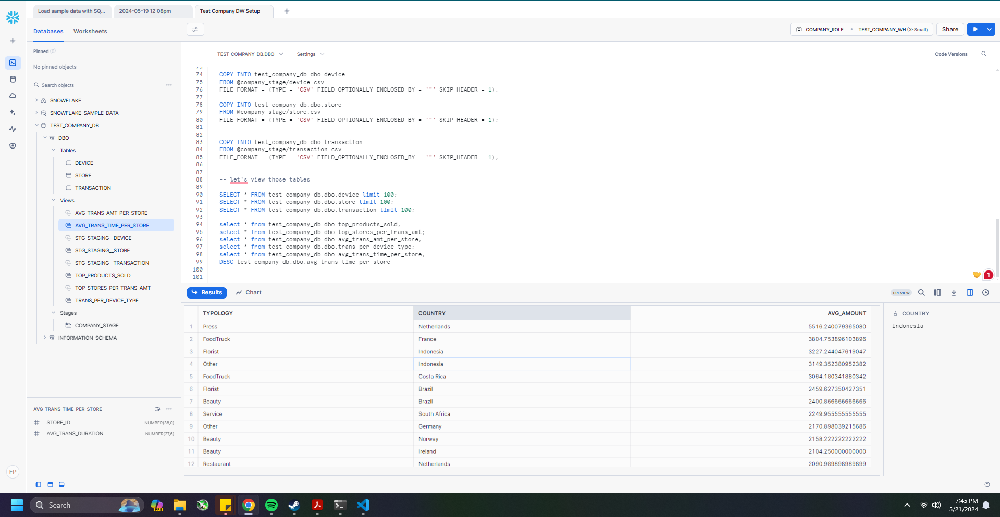


### Setting up a connection on dbt
Next is creating a project on DBT and connecting it to Snowflake.
The connection was pretty much done most by Snowflake on the project setup.


### Creating the models.


*NOTE: to see the repo for my dbt code, you can check it [here](https://github.com/freanuperiaa/dbt_test_company)*

I would first need to set up the tables that I'm going to use for the models.
I simply read them using an SQL file, and specified the needed details (database, schema) in the `schema.yml`. I placed all the needed tables in a folder `staging`, and placed all the needed models in `core` folder.

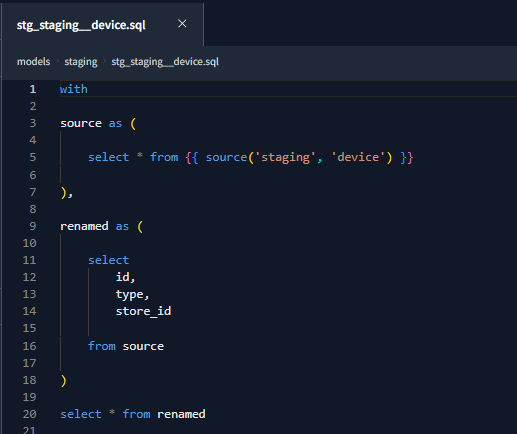


### First Model - Top 10 stores per transacted amount
For this, I assumed it to be the ten stores that had the highest transacted amount.
The code for the first model ([top_stores_per_trans_amt.sql](https://github.com/freanuperiaa/dbt_test_company/blob/master/models/core/top_stores_per_trans_amt.sql)): 
```
{{
    config(
        materialized='view'
    )
}}

-- after several tries, when i add materialized='table' in config, it always says
--   000606 (57P03): No active warehouse selected in the current session.  Select an active warehouse with the 'use warehouse' command.
-- well look into ^that probably later


WITH transactions AS (
    SELECT * FROM {{ ref('stg_staging__transaction') }}
),

stores AS (
    SELECT *FROM {{ ref("stg_staging__store") }}
),

devices AS (
    SELECT * FROM {{ ref("stg_staging__device") }}
),

total_trans_amt_by_device AS (
SELECT 
    device_id
    ,total_trans_amount 
    ,ROW_NUMBER() OVER(ORDER BY total_trans_amount DESC) AS row_num -- top 10
FROM 
    {{ ref("trans_amt_by_device") }}

)

SELECT
    B.store_id
    ,C.name AS store_name -- might not be needed
    ,A.total_trans_amount AS transacted_amount

FROM
    total_trans_amt_by_device A LEFT JOIN devices B
        ON A.device_id = B.id
    LEFT JOIN stores C 
    -- NOTE: not sure if I have to have the store name for this model. but If it were me, I would normalize fact tables, hence I would just simply remove the store names, removing the need to join the stores table.
        ON B.store_id = C.id

WHERE
    A.row_num <= 10
    

ORDER BY A.total_trans_amount DESC


```

I called all the tables that we currently have as I suppose additional info would be needed for the table. As I have mentioned at the comment at the bottom, I would remove it if it would not be used for reports.


I also created a model to be used for this model, which is `trans_amt_by_device`. When I was doing the models for the other items, I figured that having a table that had all the needed info (avg amount, sum amount) for a device would be *better performance-wise*, since we don't need to look up the transactions table. 

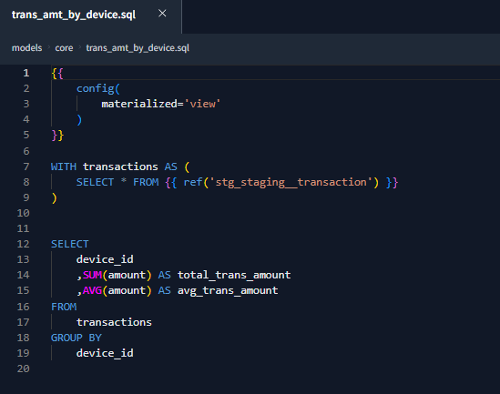

The only dillema that I have with dbt is that, I can't seem to materialize the models as a table on Snowflake, due to some configuration problems. I already had set up the snowflake connection and it's already working, so I'll leave my models as views, but I do know that *some models are better off materialized as tables*.


The lineage of the model:
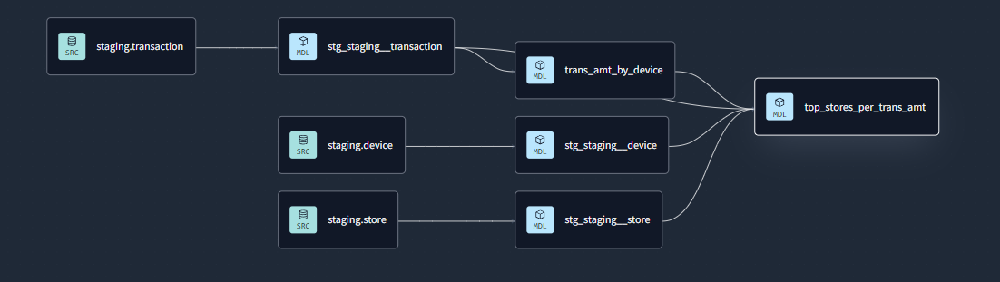

The data on Snowflake:
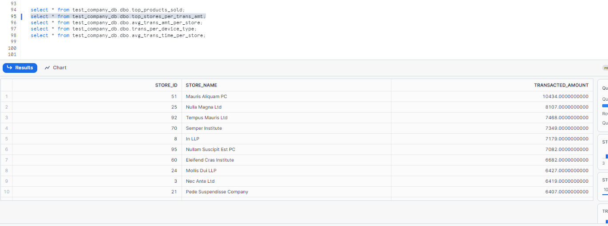

### Second Model - Top 10 products sold

The code for the second model ([top_products_sold.sql](https://github.com/freanuperiaa/dbt_test_company/blob/master/models/core/top_products_sold.sql)):
```
{{
    config(
        materialized='view'
    )
}}

WITH transaction AS (
    SELECT * FROM {{ ref('stg_staging__transaction') }}
),


transactions_per_item AS (
    SELECT 
        product_sku
        ,COUNT(1) as num_transactions
        ,ROW_NUMBER() OVER(ORDER BY COUNT(1)) AS row_num
    FROM 
        transaction
    GROUP BY
        product_sku
    ORDER BY
        row_num
)

SELECT 
    product_sku
    ,num_transactions 

FROM 
    transactions_per_item

WHERE 
    row_num <= 10

ORDER BY num_transactions DESC
```


For this, I simply counted how many transactions there were for every product_SKU, then I would only have to take the top 10. I used the function `ROW_NUMBER()` so that I could give a value of a row's (or a product_sku's) rank based on the number of transactions it had - All this I placed in a CTE transactions_per_item.

Next, I just selected the sku and the number of transactions on the last query, and filtered it by the row_number that we had earlier.


The lineage of the model:
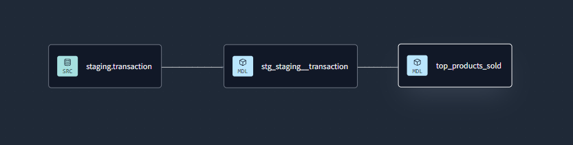

The data on Snowflake:
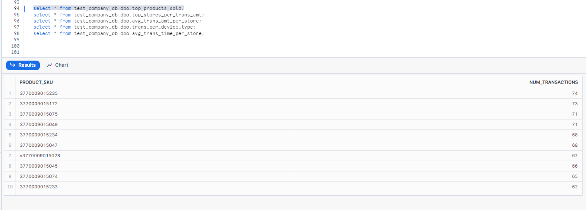


### Third Model - Average transacted amount per store typology and country
The code for the third model ([avg_trans_amt_per_store.sql](https://github.com/freanuperiaa/dbt_test_company/blob/master/models/core/avg_trans_amt_per_store.sql)):

```
{{
    config(
        materialized='view'
    )
}}

WITH stores AS (
    SELECT *FROM {{ ref("stg_staging__store") }}
),

devices AS (
    SELECT * FROM {{ ref("stg_staging__device") }}
),

total_trans_amt_by_device AS (
    SELECT device_id, avg_trans_amount FROM {{ ref("trans_amt_by_device") }}
)

SELECT
    C.typology AS typology 
    ,C.country AS country
    ,AVG(A.avg_trans_amount) AS avg_amount

FROM
    total_trans_amt_by_device A LEFT JOIN devices B
        ON A.device_id = B.id
    LEFT JOIN stores C 
        ON B.store_id = C.id

GROUP BY
    C.typology
    ,C.country

ORDER BY avg_amount DESC


```

For this model, I also used the model `trans_amt_by_device`, which also contains the average transaction amount per device.

So I just took the amounts per device that we had earlier, and joined it to the devices (to know what store that device belonged to) and joined it to the stores tables, to know the typology and country.

Then I selected the typology, country, and the average of average transacted amount per device, and grouped them all by typology and country.


The lineage of the model:
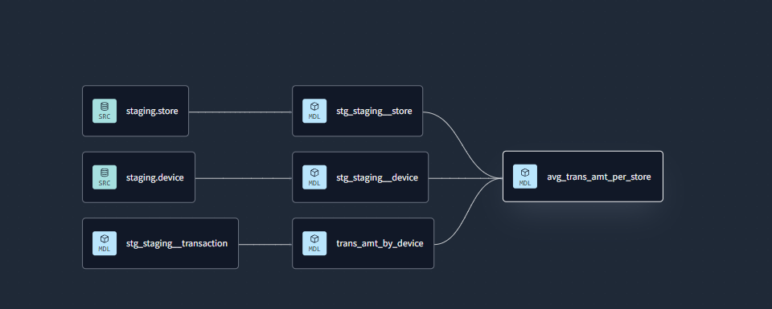

The data on Snowflake:
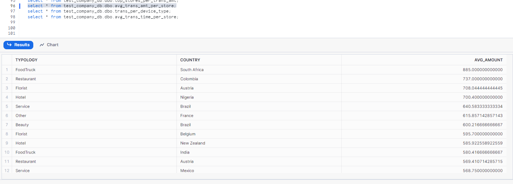


### Fourth Model - Percentage of transactions per device type
The code for the fourth model ([trans_per_device_type.sql](https://github.com/freanuperiaa/dbt_test_company/blob/master/models/core/trans_per_device_type.sql)):

```
{{
    config(
        materialized='view'
    )
}}

WITH transactions AS (
    SELECT * FROM {{ ref('stg_staging__transaction') }}
),

devices AS (
    SELECT * FROM {{ ref("stg_staging__device") }}
),


transations_device AS (
    SELECT
        B.type AS device_type
        ,COUNT(A.id) AS count_trans
    
    FROM 
        transactions A LEFT JOIN devices B
            ON A.device_id = B.id

    GROUP BY B.type
),

total_trans AS (
    -- this should return a single row
    SELECT COUNT(1) AS total_transactions FROM transactions
)

SELECT
    A.device_type
    ,(A.count_trans / B.total_transactions) AS pct

FROM
    -- cross join to the single rowed table
    transations_device A,
    total_trans B

ORDER BY pct DESC


```

For this model, I need two things: 
- I had to take the number of transactions per device type
- I had to take the number all transactions

So for the first one, I just simply created a CTE containing the type and count of transactions from the transactions table for that type.

For the second one, I created a CTE which returns the total number of transactions. Since this would only return a single row, it would be perfect for a cross join with the first CTE that we created.

Finally, we would join those two temp tables simply by a cross join. Then we would take the device type, and its count, and divide it by the total number of transactions.


The lineage of the model:
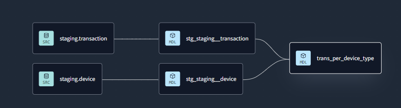

The data on Snowflake:
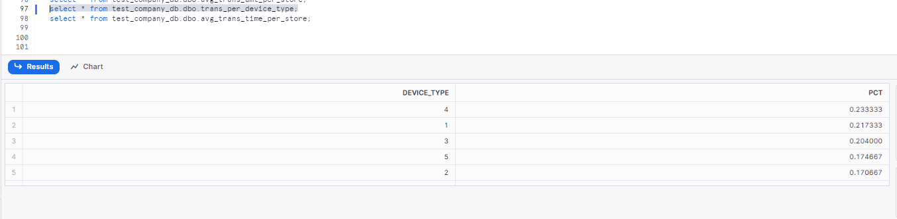


### Fifth Model - Average time for a store to perform its 5 first transactions
The code for the fifth model ([avg_trans_time_per_store.sql](https://github.com/freanuperiaa/dbt_test_company/blob/master/models/core/avg_trans_time_per_store.sql))
```
{{
    config(
        materialized='view'
    )
}}


WITH transactions AS (
    SELECT * FROM {{ ref('stg_staging__transaction') }}
),

devices AS (
    SELECT * FROM {{ ref("stg_staging__device") }}
),


ranked_transactions_device AS (
    SELECT
        A.id AS transaction_id
        ,A.device_id AS device_id
        ,B.store_id AS store_id
        ,A.happened_at 
        ,ROW_NUMBER() OVER(PARTITION BY B.store_id ORDER BY A.happened_at) AS row_num

    FROM
        transactions A LEFT JOIN devices B
            ON A.device_id = B.id

    ORDER BY row_num
),

ranked_transactions_device_next_trans AS (
    SELECT 
        A.transaction_id
        ,A.device_id
        ,A.store_id
        ,A.happened_at
        ,B.happened_at AS next_trans_happened_at
        ,A.row_num

    FROM
        ranked_transactions_device A LEFT JOIN ranked_transactions_device B
            ON A.store_id = B.store_id
            AND (A.row_num + 1) = B.row_num

),

top_trans_duration_rank AS (
    SELECT 
        transaction_id
        ,device_id
        ,store_id
        ,happened_at
        ,next_trans_happened_at
        ,DATEDIFF(day, happened_at, next_trans_happened_at) AS trans_duration
        ,row_num
    
    FROM 
        ranked_transactions_device_next_trans

    WHERE
        row_num <= 5
        AND trans_duration IS NOT NULL
        -- NULL trans_duration will be caused by transactions with no next_trans_happened_at. let's not account for it since there's no other better way to *count* the duration of a transaction
)


SELECT
    store_id
    ,AVG(trans_duration) AS avg_trans_duration
    -- weird behavior, won't run if the AVG is not given alias 
    -- https://stackoverflow.com/questions/56743577/snowflake-sql-compilation-error-missing-column-specification
    -- https://community.snowflake.com/s/question/0D50Z00008Zg12qSAB/how-do-i-add-currenttimestamp-to-a-view-i-keep-getting-the-error-sql-compilation-error-missing-column-specification

FROM 
    top_trans_duration_rank

GROUP BY
    store_id

ORDER BY avg_trans_duration

```

For this model, I would first take the transactions that we have for every devices. Since it was specified by the problem that it had to be the ** 5 first transactions **, I would also use `ROW_NUMBER()` so that I could get the ranking by the `happened_at` column, partitioned by `store_id`. All this saved in a CTE `ranked_transactions_device`.

Next is, I would join `ranked_transactions_device` on itself, on the columns store_id and the row_number, the left side added by one, so that we can have the `happened_at` of the next transaction of a store.

The reason why I took the next `happened_at` is because It is what I used to calculate the duration of a transaction. Yes, we have the column `created_at`, but the duration from happened_at and created_at seemed to be too far for me, and it would not make sense that a sales transaction would take that long (others would take around a year!). Taking the `happened_at` of a transaction and the `happened_at` of the next transaction of a store would make more sense if we would want to know it's duration.


In the image below, we can see with the red lines that happened_at and created_at is too far off. it's nearer to it's next transaction, which is of the same store and next rank (signified by the blue lines)
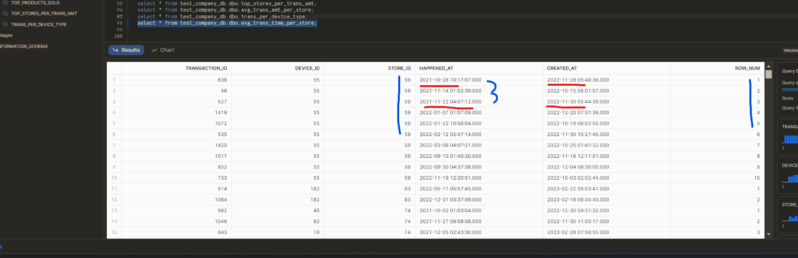


Now that we have the time of the following transaction, it's time to calculate for the difference. in the CTE `top_trans_duration_rank`, I took the difference (in days) by using `DATEDIFF()`. I also filtered the rows where the row_num should be 5 up, and the trans_duration is not null. NULL `trans_duration`s happens when a particular transaction of a store has no following transaction. Since we have no reference on the duration of the transaction, we're better off with not considering them.

Finally, we took the `store_id` and took the average of `trans_duration` for that store, grouping them by the `store_id`

The lineage of the model:
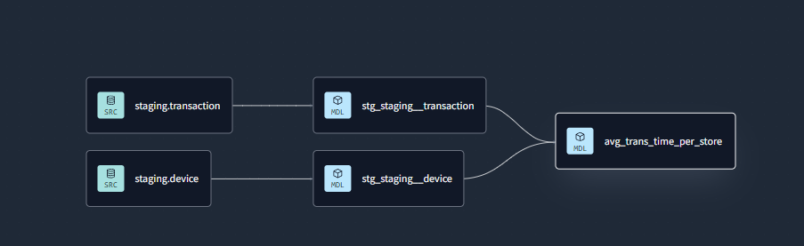

The data on Snowflake:
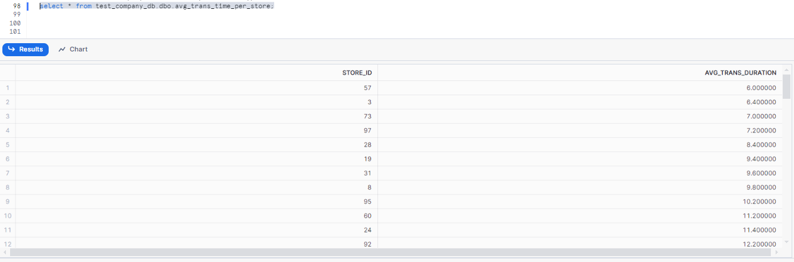

